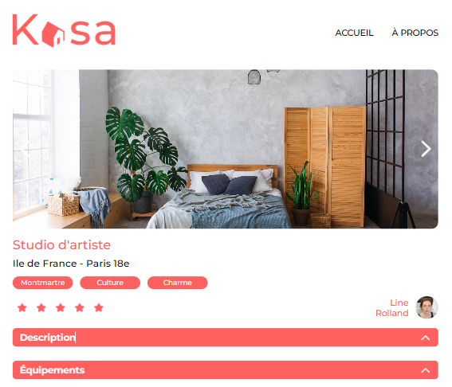

# Kasa

## Description
Application de recherche de logements.Implémentation du front end avec des composants réutilisables React, création des routes de l’application avec React Router et stylisé avec Sass.

## Technologies


## Aperçu


## Installation
Cloner le repos:
```bash
git clone https://github.com/Emmie1428/Kasa
cd kasa
npm install
npm start
```
